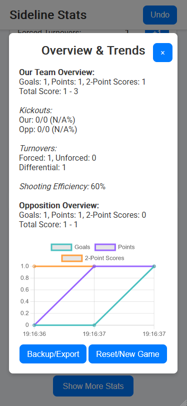

# Sideline Gaelic

**Sideline Gaelic** is a Progressive Web App (PWA) designed for Gaelic football teams to track in-game statistics in real time. Optimized for mobile use with a responsive, touch-friendly interface, it works offline with service worker caching and features trend visualization powered by Chart.js. Perfect for sideline use, Sideline Gaelic helps you record, analyze, and export stats quickly during the game.

## Features

-   **Real-time Stats Tracking:**  
    Record goals, points, 2-point scores, kickouts (won/lost for both teams), turnovers, and shooting metrics.

-   **Fast Team Switching:**  
    Top tabs let you switch between **Our Team** and **Opposition** basic scoring views, with mobile swipe left/right support.

-   **Flexible Score Display:**  
    Tap either score line to toggle between `goals-points` format and full points total (`goal=3`, `2-point=2`, `point=1`).

-   **Responsive & Touch-Friendly:**  
    Fluid layouts and large touch targets ensure seamless use on any mobile device.

-   **Progressive Web App (PWA):**  
    Offline support, installable via a web app manifest, and full-screen standalone mode.

-   **Trend Visualization:**  
    Integrated Chart.js displays trends in basic stats over time.

-   **Backup/Export Functionality:**  
    Download current stats as a JSON file for backup or further analysis.

-   **Service Worker Caching:**  
    Speeds up load times and ensures offline availability.

## Installation

Clone the repository:

```bash
git clone https://github.com/robmcelhinney/sideline-gaelic.git
```

Then open index.html in your browser. For a live demo, deploy the project to GitHub Pages.

## Usage

-   Recording Stats:
    Tap the buttons to increment stats. Use the Undo button to correct mistakes.

-   Team Tabs:
    Use the **Our Team** / **Opposition** tabs (or swipe horizontally on mobile) to switch basic scoring views quickly.

-   Advanced Tracking (Both Sides):
    Advanced stats are always visible in a shared card beneath the tabs. Use the **Show Kickouts / Hide Kickouts** button in the Kickouts header to collapse or expand kickout details.

-   Score Format Toggle:
    Tap a team score row to switch between `Score: goals - points` and `Total Points: N`.

-   Overview & Trends:
    Click **Show More Stats** to open a modal with overview and trend panels, plus backup/export and reset actions. The modal also closes via backdrop tap or `Esc`.

-   Installable:
    On mobile, add the app to your home screen for a native-like experience.

## PWA Setup

The project includes:

-   A manifest.json file for app metadata, icons, and display configuration.

-   A service worker (sw.js) for caching assets and offline functionality.

## Screenshot




## Contributing

Contributions are welcome! Feel free to open issues or submit pull requests to enhance functionality, fix bugs, or improve performance.

## License

This project is licensed under the MIT License.
